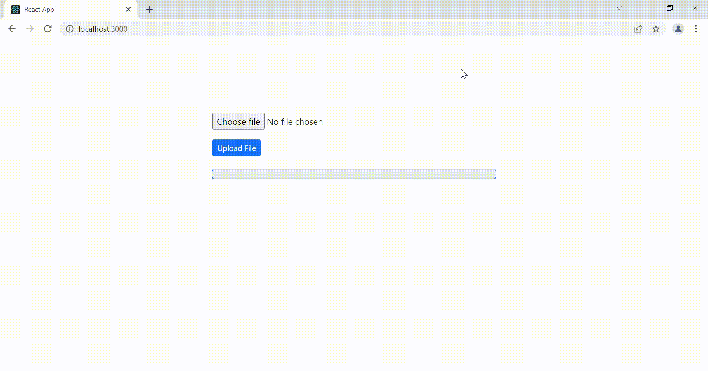

# data-prep-ui
A UI tool to cleanse the csv files.


## Installation

-  [Node](https://nodejs.org/en/)
-  [Python](https://www.python.org/downloads/)
-  Use the package manager [pip](https://pip.pypa.io/en/stable/) to install pandas.
```bash
pip install pandas
```
```bash
pip install sklearn
```
- Clone the repo and install the dependencies.
```
git clone https://github.com/sudo-win/data-prep-ui.git
```
  ```sh
  cd data-prep-ui/client
  npm install
  ```
  ```sh
  cd data-prep-ui/server
  npm install
  ```

## Run locally
  ```sh
  cd data-prep-ui/client
  npm start
  ```
  ```sh
  cd data-prep-ui/server
  npm start
  ```
  
Open http://localhost:3000.




